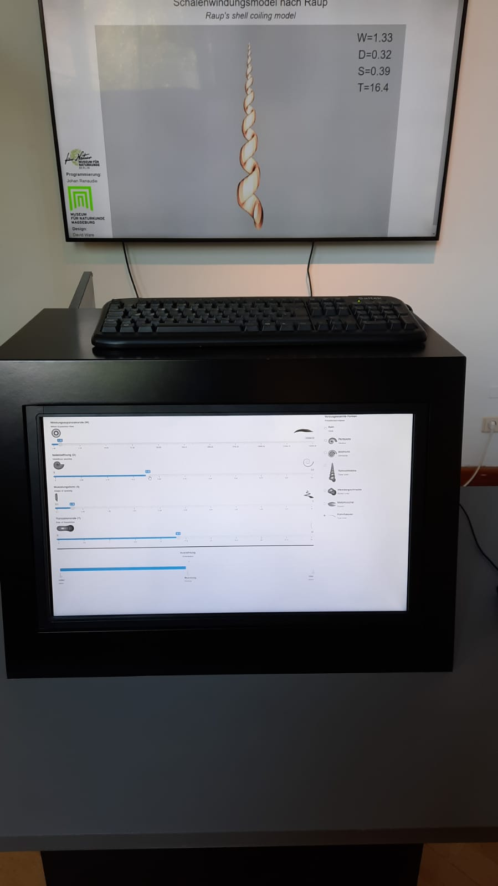

## Raup's Coiling Model

Shiny app to play with Raup's coiling model, for the exhibition at the Museum für Naturkunde in Magdeburg.

Meant to be displayed as two screens: one (the Controller window) on a touchscreen display, the second (the Plot window) projected on a screen.

